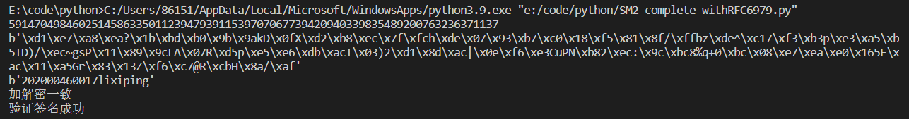
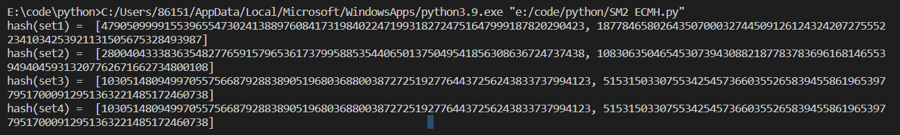
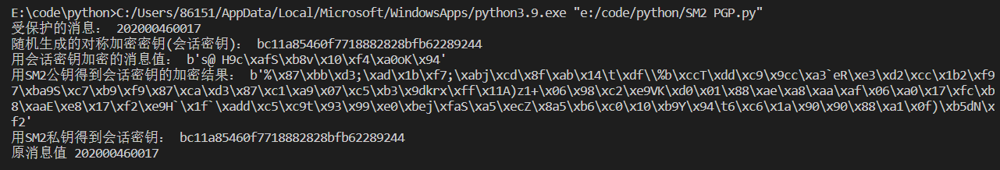
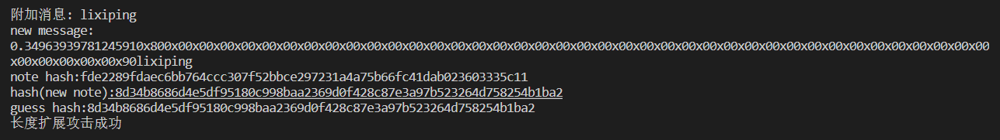
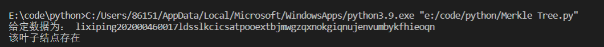
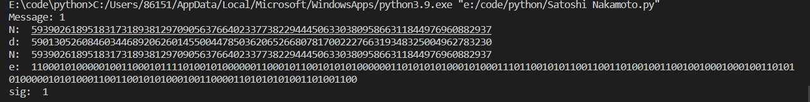
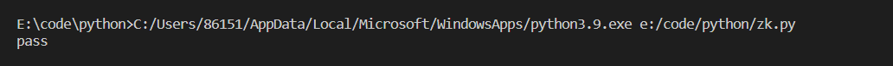

# project collection
 关于课程项目的介绍

 1.小组成员：李熙平 git名称expabout，内容独自完成

 2.完成了sm2、sm3、bitcoin和zk部分的内容

 3.完成的项目如下

 - impl sm2 with RFC6979 (SM2 complete withRFC6979.py)
 - implement the above ECMH scheme Decrypt (SM2 ECMH.py)
 - implement a PGP scheme with SM2 (SM2 PGP.py)
 - implement the naive birthday attack of reduced SM3 (birthday attack.py)
 - implement the Rho method of reduced SM3 (Rho method of SM3.py)
 - implement length extension attack for SM3,SHA256,etc (length extension attack.py)
 - implement Merkle Tree following RFC6962 (Merkle Tree.py)
 - forge a signature to pretend that you are Satoshi (Satoshi Nakamoto.py)
 - Write a circuit to prove that your CET6 grade is       larger than 425. (zk.py)

 4.代码说明
 - 对于sm2 with RFC6979，首先生成公私钥对，其次设置消息和用户ID，最后最后使用私钥进行签名，然后设置随机数k，并计算P点，计算结果做为签名输出。验证过程同理。
 - 对于SM2 ECMH,ECMH思想为将哈希映射成椭圆曲线上的点，然后利用ECC的加法添加信息，将信息存储在元组中，对元组中的每一个元素调用函数得到对应的哈希映射成椭圆曲线上的点。定义H函数传入元组，对元组中的数据遍历并通过hash后得到x，计算出对应的y值，得到椭圆曲线上的点，将元素对应的椭圆曲线上的点相加得到结果。
 - 对于sm2 PGP,提前规定好sm2非对称加密的公私钥对，并将公钥传递给对方，对方利用公钥加密对称密钥，利用对称密钥加密消息连同加密后的对称密钥一起发送过来，收到后利用私钥解密得到对称密钥，利用对称密钥可以解密出明文消息。其中加密对称密钥时用sm2进行加密
 - 对于birthday attack，随机选取2个消息，以这2个消息作为杂凑函数的输入，计算出相应的杂凑值，寻找使H(m1)=H(m2)成立的不同元m1和m2，如果找到，就将(m1,m2)作为结果输出，算法终止。
 - 对于Rho method of reduced SM3，对于两个输入，一个输入每次进行一次hash，而另一个输入每次进行两次hash,对二者的结果前几bit进行比较 若相等则碰撞成功
 - 对于length extension attack for SM3,对SM3算法进行长度扩展攻击，根据原始字串m，扩展字串e，实现：对扩展字串e补1和0进行消息填充；计算新消息M的长度，M=m||10...||len(m)||e;利用hash(m)与e||10...||len(M) 继续迭代压缩，计算出攻击结果
 - 对于Merkle Tree,在构造Merkle树时，首先要对数据块计算哈希值，通常，选用SHA-256等哈希算法。然后将数据块计算的哈希值两两配对（如果是奇数个数，最后一个自己与自己配对），计算上一层哈希，再重复这个步骤，一直到计算出根哈希值。
 - 对于forge a signature基于数字签名。 中本聪创世区块挖矿地址1A1zP1eP5QGefi2DMPTfTL5SLmv7DivfNa；如果我们要证明自己是中本聪，则需拿创世区块地址签名，最终验证“我是中本聪”则拿“创世区块挖矿的地址+原消息+签名”即可验证
 - 对于zk，首先模拟教育部生成成绩信息，并把hash值放在链上，雇佣者可以查到来自教育部的验证确认成绩合法有效，求职者只需把对成绩的签名交给求职者即可实现零知识证明，如通过则输出pass。

 5.运行结果

 按项目结果展示，其中Rho methon of reduced SM3以及birthday attack of reduced SM3由于时间复杂度过高，没有运行结果.

 impl sm2 with RFC6979
 

 implement the above ECMH scheme Decrypt
 

 implement a PGP scheme with SM2 
 

 implement length extension attack for SM3,SHA256,etc
 

 implement Merkle Tree following RFC6962 
 

 forge a signature to pretend that you are Satoshi
 

 Write a circuit to prove that your CET6 grade is       larger than 425
 